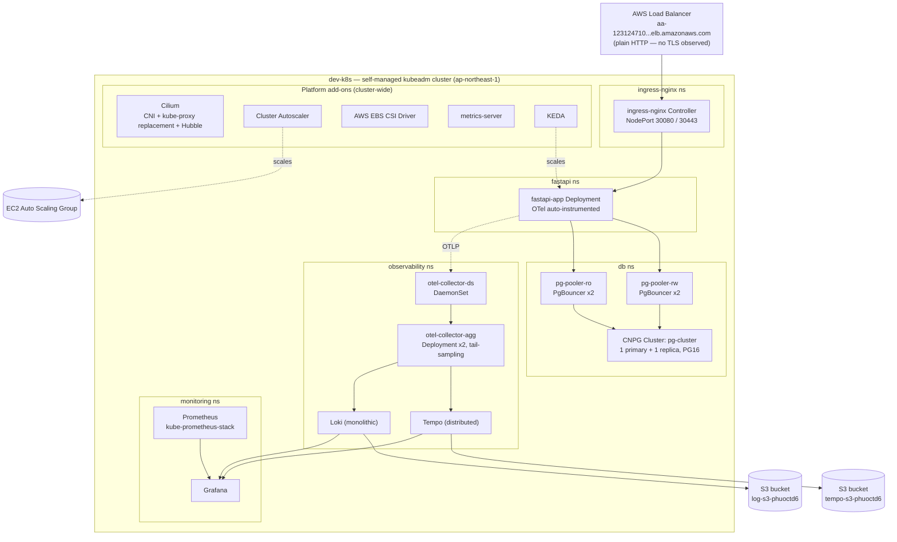
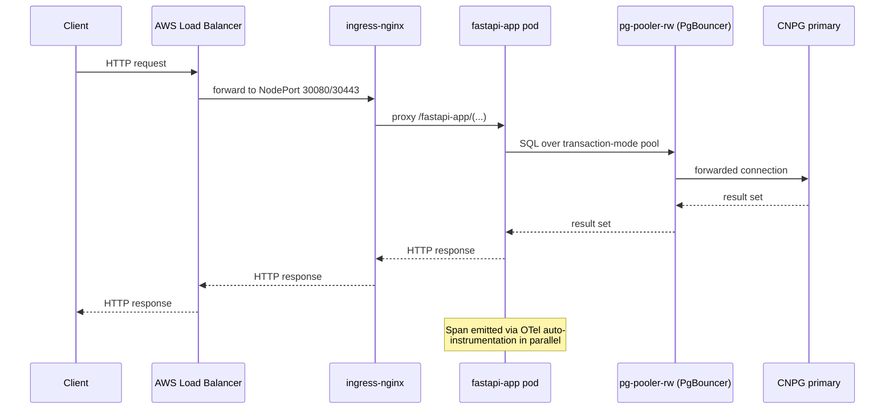
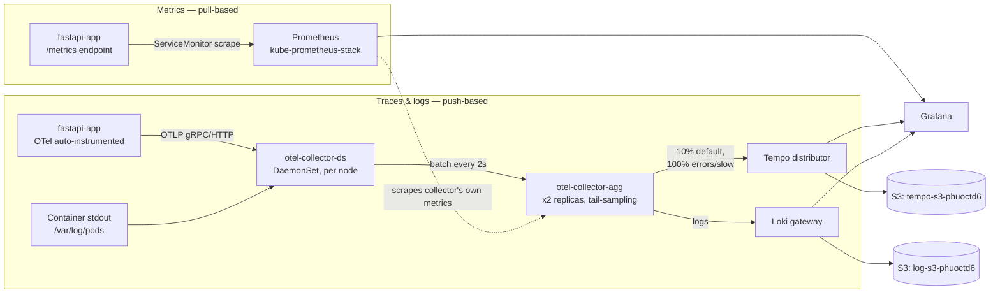
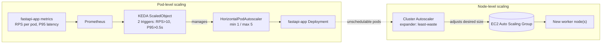

# dev-k8s — Cluster Architecture Documentation

| | |
|---|---|
| **Cluster** | `dev-k8s` — self-managed Kubernetes (`kubeadm`) on AWS EC2 |
| **Region** | `ap-northeast-1` (Tokyo) |
| **Status** | Draft — for architecture review |
| **Source** | Generated from the supplied Helm values / chart bundle. Gaps are flagged explicitly in [Section 9](#9-open-items--information-needed) rather than assumed. |

---

## Part 1 — Architecture Overview

### 1. Purpose & Scope

This document describes the platform layer of `dev-k8s`: how the cluster is networked, how it stores data, how the sample workload (`fastapi-app`) is exposed and scaled, and how observability (metrics/logs/traces) is wired end to end. It is built directly from the Helm chart values and templates in the provided bundle — every claim below is traceable to a specific file. It does **not** cover application business logic, CI/CD, or anything outside the `k8s/` and `charts/` bundle.

### 2. Cluster at a Glance

| Property | Value |
|---|---|
| Kubernetes distribution | Self-managed via `kubeadm` (not EKS/GKE) |
| Host infrastructure | AWS EC2, Amazon Linux 2 |
| Region | ap-northeast-1 |
| kube-proxy | Not installed — replaced entirely by Cilium eBPF |
| CNI | Cilium (+ Hubble observability) |
| Ingress | ingress-nginx, exposed via NodePort behind an AWS load balancer |
| Storage | AWS EBS (gp3, encrypted) via the EBS CSI driver |
| Database | PostgreSQL 16 via CloudNativePG, fronted by PgBouncer |
| Autoscaling | Cluster Autoscaler (nodes) + KEDA (pods, on Prometheus metrics) |
| Observability | Prometheus + Grafana + Loki + Tempo, fed by an OpenTelemetry Collector pipeline |
| Sample workload | `fastapi-app` (Python/FastAPI) |

### 3. High-Level Architecture

### 4. Notable Design Choices

These are the architecturally significant choices visible in the config, with what each one buys you and the trade-off that comes with it. (These describe what the configuration *implies*, not a record of the original decision-making — worth confirming intent with the team during review.)

| Choice | What it provides | Trade-off to weigh |
|---|---|---|
| Self-managed `kubeadm` on EC2, not EKS | Full control plane access, no EKS hourly cost, free choice of CNI/version | You own control-plane HA, upgrades, and etcd backup/restore — none of that is visible in this bundle |
| Cilium + kube-proxy replacement | Lower per-packet overhead than iptables at scale; native Hubble flow visibility | Operationally newer/less familiar than Calico/iptables for teams without eBPF experience |
| CloudNativePG instead of RDS/Aurora | No managed-DB cost, full Postgres version control, GitOps-friendly | You own backup/restore, failover testing, and patching — CNPG automates *mechanics*, not the operational responsibility |
| PgBouncer pooler split into RW/RO | Connection pooling protects Postgres from connection-storm exhaustion; RO pooler enables read scale-out | An extra hop and another moving part to monitor; pool exhaustion becomes a new failure mode to watch for |
| KEDA on custom Prometheus queries (RPS, P95) instead of plain CPU HPA | Scaling reacts to actual user-facing load, not just CPU | Scaling is now dependent on the metrics pipeline (Prometheus) being healthy — if Prometheus is down, KEDA can't see triggers |
| Self-hosted Prometheus/Loki/Tempo + OTel Collector with tail-sampling | No per-GB SaaS observability billing; full control over retention/sampling | You're operating three stateful-ish systems yourselves, including S3 lifecycle and a 2-tier collector pipeline |

### 5. Component Inventory

| Layer | Component | Namespace | Role |
|---|---|---|---|
| Networking | Cilium | `kube-system`* | CNI, kube-proxy replacement, Hubble flow observability |
| Storage | AWS EBS CSI Driver | `kube-system`* | Dynamic `gp3` encrypted volume provisioning |
| Node scaling | Cluster Autoscaler | `kube-system`* | Adds/removes EC2 nodes via ASG based on pending pods |
| Metrics plumbing | metrics-server | `kube-system`* | Provides `kubectl top` / resource metrics API |
| Pod scaling | KEDA | `keda`* | Event/metric-driven `ScaledObject` → HPA |
| Ingress | ingress-nginx | `ingress-nginx`* | L7 ingress, NodePort 30080/30443, OTel tracing enabled |
| Database operator | CloudNativePG | `cnpg-system` | Manages Postgres `Cluster` and `Pooler` CRDs |
| Database | `pg-cluster` (chart: `postgresql`) | `db` | Postgres 16, 1 primary + 1 replica, PgBouncer RW/RO poolers |
| Application | `fastapi-app` | `fastapi`* | Sample FastAPI service behind ingress, KEDA, OTel |
| Tracing/log collection | OpenTelemetry Operator + `charts/otel` | `observability` | Collector DaemonSet + Aggregator, `Instrumentation` CR |
| Tracing backend | Tempo (distributed) | `observability` | OTLP trace storage on S3 |
| Log backend | Loki (monolithic) | `observability` | Log storage on S3 |
| Metrics backend | kube-prometheus-stack (Prometheus, Grafana) | `monitoring` | Metrics scraping, dashboards; Alertmanager **disabled** |

\* *Namespace not pinned inside the values file itself (set via `--namespace` at `helm install` time); shown is the chart's conventional default. Worth confirming against your actual `helm list -A` output.*

### 6. Request & Data Flow

Read paths follow the same shape via `pg-pooler-ro`, which load-balances across all CNPG replica instances (currently just the one).

### 7. Observability Pipeline

Metrics and traces/logs travel two structurally different paths — this distinction matters operationally, since each path fails independently.

Key tuning detail: the DaemonSet's batch timeout (2s) is deliberately shorter than the Aggregator's tail-sampling decision window (10s), so all spans for a trace arrive before the sampling decision is made — errors and slow requests (>2000ms) are always kept; everything else is sampled at 10%.

### 8. Autoscaling Chain

Scale-out reacts within ~1 minute of sustained load (30s stabilization, +2 pods per 60s step); scale-down is equally conservative. Cluster Autoscaler waits 8 minutes of idle before removing a node, and never touches nodes carrying control-plane or system pods.

### 9. Open Items — Information Needed

Not visible from the config bundle alone — worth confirming before this doc is treated as authoritative:

- **Node topology:** number of control-plane nodes (1 = no control-plane HA, no etcd quorum), number/size of worker nodes, single-AZ or multi-AZ placement.
- **Environment scope:** is `dev-k8s` literally a throwaway dev environment, or the *only* cluster (i.e., does staging/prod look the same, or does this diverge significantly at higher tiers)?
- **Domains & TLS:** the only hostname observed is the raw ELB DNS name (`aa-123124710...elb.amazonaws.com`) over plain HTTP. No app domain, no TLS/cert-manager config, no WAF was found anywhere in the bundle.
- **VPC/network design:** CIDR ranges, subnet layout (public/private), security groups — not present in any file here.
- **Bootstrap automation:** several files reference `deploy.sh` and `cloud-init-control-plane.sh` as the actual install mechanism (e.g., for setting `k8sServiceHost`, creating namespaces, copying secrets across namespaces) — neither script was included in this bundle, so the *actual* bring-up procedure isn't fully documented here.

### 10. Findings Worth Flagging in Review

Things spotted while reading the configs that are worth a conscious decision (fix, accept, or defer) rather than silently shipping:

1. **No TLS anywhere observed.** ELB hostname is referenced as `http://`, ingress-nginx's only `tls: []` block (in `fastapi-app`) is empty, and there's no cert-manager/ACM reference in the bundle.
2. **Grafana admin password is set in plaintext inside `kube-prometheus-stack-values.yaml`.** This file would need to be kept out of any public repo, or migrated to a Secret/sealed-secret before this cluster is anything other than throwaway.
3. **Alertmanager is explicitly disabled** (`alertmanager.enabled: false`) — metrics and dashboards exist, but nothing pages anyone today.
4. **Several single points of reduced resilience at current replica counts:** `ingress-nginx` (1), `fastapi-app` (1, though KEDA can scale it up under load), the OTel Operator (1), Loki (`Monolithic` mode, `replication_factor: 1`), and the CNPG *operator* itself (1 — note this is separate from the Postgres `Cluster`, which does run 2 instances).
5. **Database name mismatch:** `charts/postgresql/values.yaml` provisions a database named `TestDb`, but `charts/fastapi-app/fastapi-app-pg-patch.yaml` sets the app's `DB_NAME` to `appdb`. One of these is stale.
6. **Cross-namespace secret access is a known, called-out gap.** `pg-app-secret` lives in `db`; `fastapi-app` needs it from the `fastapi` namespace. The patch file documents three options (manual copy, External Secrets Operator/Reflector, or co-locating namespaces) but doesn't commit to one — this should be resolved deliberately, not left to whichever engineer runs `deploy.sh` next.
7. **Cilium routing mode comment/value mismatch:** the file's header comment describes "native routing — no overlay," but `routingMode` is actually set to `tunnel`, not `native`. Worth double-checking which one is actually intended/running.
8. **Tempo compactor retention comment mismatch:** `block_retention: 24h` is annotated `# 14 days` in the values file — the configured value (24h) and the comment (14d) disagree by a wide margin; confirm the intended retention.
9. **`fastapi-app` chart version drift:** `Chart.yaml`'s `appVersion` references one git commit SHA while `values.yaml`'s `image.tag` references a different one — likely just a stale `Chart.yaml`, but worth a quick check.

---

## Part 2 — Detailed Reference Appendix

### A. Cluster Foundation

#### A.1 Control Plane & Node Provisioning
- Provisioned via `kubeadm` on Amazon Linux 2 EC2 instances (not a managed control plane).
- `kube-proxy` is skipped at `kubeadm init` time (`skipPhases: addon/kube-proxy`) — Cilium's eBPF dataplane is the only Service-routing mechanism in the cluster.
- Referenced but not included in this bundle: `cloud-init-control-plane.sh` (initial bootstrap) and `deploy.sh` (re-applicable upgrades/installs).

#### A.2 Networking — Cilium
*File: `k8s/helm/cilium-values.yaml`*

| Setting | Value | Note |
|---|---|---|
| `routingMode` | `tunnel` | Comment in the file describes native routing, but the active setting is tunnel mode — see Finding #7 |
| `kubeProxyReplacement` | `true` | Full eBPF replacement of kube-proxy |
| `ipam.mode` | `kubernetes` | |
| `bpf.masquerade` | `true` | eBPF masquerade instead of iptables MASQUERADE |
| NodePort range | `30000–32767` | Covers ingress-nginx's 30080/30443 |
| `k8sServiceHost` / pod CIDR | passed via `--set` at install time | Not static in the values file |
| Hubble | `enabled`, with `relay` and `ui` enabled | UI exposed via ingress-nginx at `/hubble` |
| Hubble metrics | `dns`, `drop`, `tcp`, `flow`, `icmp`, `http` | Scraped by kube-prometheus-stack |
| Agent resources | 100m/128Mi request → 500m/512Mi limit | |
| Tolerations | `operator: Exists` | Cilium runs on every node including control-plane, since it bootstraps the CNI before taints apply |

#### A.3 Storage — AWS EBS CSI Driver
*File: `k8s/helm/ebs-csi-values.yaml`*

- StorageClass `ebs-csi`: `gp3`, `encrypted: true`, `volumeBindingMode: WaitForFirstConsumer`, `reclaimPolicy: Delete`.
- Controller: 2 replicas with topology spread (`maxSkew: 1` across hostnames).
- This is the StorageClass used by Postgres (CNPG), Prometheus, and Grafana persistent volumes.

#### A.4 Node Autoscaling — Cluster Autoscaler
*File: `k8s/helm/auto-scaler-values.yaml`*

- `cloudProvider: aws`, auto-discovers ASGs tagged for cluster `dev-k8s` (standard `k8s.io/cluster-autoscaler/<name>=owned` tagging convention is assumed — confirm your ASG tags match).
- Expander: `least-waste`. Balances similarly-configured ASGs evenly.
- Scale-down: 8 min unneeded before removal; 8 min delay after scale-up; system-pod-carrying nodes are protected (`skip-nodes-with-system-pods: true`).
- Pinned to the control-plane node via `nodeSelector`/`tolerations` — a single point worth confirming has a node to schedule onto, especially if there's only one control-plane node (see Open Item — node topology).

#### A.5 metrics-server
*File: `k8s/helm/metrics-server-values.yaml`*

- 15s metric resolution, `--kubelet-insecure-tls` (acceptable for a self-managed cluster without kubelet serving certs signed by a trusted CA — revisit if that changes).
- Feeds `kubectl top` and any plain-CPU HPAs; **not** the source of KEDA's scaling triggers (those query Prometheus directly).

### B. Ingress

#### B.1 ingress-nginx
*File: `k8s/helm/ingress-nginx-values.yaml`*

- 1 controller replica, exposed as `NodePort` (`http: 30080`, `https: 30443`) — there's no Service of type `LoadBalancer` in-cluster; the external AWS load balancer targets these NodePorts on the EC2 instances directly.
- OpenTelemetry tracing built into the controller itself (`enable-opentelemetry: true`), exporting to `otel-collector-ds-collector.observability.svc.cluster.local:4317` — meaning ingress-level spans appear in Tempo alongside application spans.
- Metrics + `ServiceMonitor` enabled for Prometheus scraping.
- Resource budget: 100m/128Mi request → 300m/256Mi limit.
- `defaultBackend.enabled: true`.

### C. Application Platform

#### C.1 KEDA
*File: `k8s/helm/keda-values.yaml`*

- Standard install: operator, metrics API server, and webhooks, each with their own resource budget and `ServiceMonitor`.
- Acts purely as the plumbing — the actual scaling logic lives in each workload's `ScaledObject` (see `fastapi-app` below).

#### C.2 `fastapi-app` chart
*Files: `charts/fastapi-app/*`*

- **Image:** `gintaku98/k8s_fastapi`, tagged by git commit SHA. `Chart.yaml`'s `appVersion` references a *different* commit than `values.yaml`'s `image.tag` (Finding #9).
- **Service/Ingress:** ClusterIP on port 80 → container port 8000; ingress path `/fastapi-app(/|$)(.*)` with a rewrite target, `ingressClassName: nginx`. No host set (path-based routing off the bare ELB hostname) and `tls: []`.
- **Database wiring:** the base `values.yaml` ships a placeholder `database` block (`writehost`/`readhost` pointing at the poolers, password `changeme`); `fastapi-app-pg-patch.yaml` is a documented *patch* that adds real env vars sourced from the `pg-app-secret` Secret via `secretKeyRef` — and explicitly calls out the cross-namespace Secret problem (Finding #6).
- **Autoscaling (KEDA):** `minReplicas: 1`, `maxReplicas: 5`; two Prometheus-based triggers:
  - Per-pod request rate > 10 req/s (`sum(rate(http_requests_total[1m])) / ready_replicas`)
  - P95 latency > 0.5s (`histogram_quantile(0.95, http_request_duration_seconds_bucket)`)
  - Scale-up: 30s stabilization, +2 pods per 60s. Scale-down: 30s stabilization, −2 pods per 60s (comment in the file says "wait 5m" but the configured value is 30s — worth a check).
- **OpenTelemetry:** a single pod annotation triggers the OTel Operator's webhook to inject the Python auto-instrumentation init-container; all `OTEL_*` env vars come from the `Instrumentation` CR in `charts/otel`, not from this chart.
- **Probes:** liveness/readiness enabled, 10s initial delay, 10s period, 3 failure threshold.
- **Resources:** 100m/126Mi request → 200m/256Mi limit.

### D. Data Layer

#### D.1 CloudNativePG Operator
*File: `k8s/helm/cnpg-values.yaml`*

- Installed into `cnpg-system`, watches **all** namespaces (`watchNamespaces: []`).
- Operator itself: 1 replica, 100m/128Mi → 500m/256Mi.
- Emits a Grafana dashboard and `PodMonitor` automatically (`monitoring.grafanaDashboard.create: true`, into the `monitoring` namespace).

#### D.2 `postgresql` chart (Cluster + Poolers)
*Files: `charts/postgresql/*`, namespace `db`*

**Cluster (`pg-cluster`):**
- PostgreSQL 16.3 (`ghcr.io/cloudnative-pg/postgresql:16.3`), `instances: 2` → 1 primary + 1 replica.
- Bootstraps database `TestDb` owned by `appuser` (see Finding #5 re: name mismatch with the app's patch file).
- Storage: 1Gi on `ebs-csi`; `walStorage.enabled: false` (WAL shares the main volume — worth revisiting if write volume grows, since WAL contention can affect both PostgreSQL performance and recovery point objectives).
- Key Postgres parameters: `max_connections=100`, `shared_buffers=128MB`, `effective_cache_size=512MB`, `wal_level=logical`, `max_wal_senders=10`, `max_replication_slots=10` (logical replication slots are reserved — relevant if you plan CDC or logical replication consumers later).
- Resources: 200m/128Mi → 1000m/500Mi.
- Anti-affinity: `preferred` (not `required`) pod anti-affinity across hostnames — primary and replica are *encouraged*, not guaranteed, to land on different nodes.
- `enableSuperuserAccess: true` — CNPG manages a separate superuser Secret from the app-user Secret.

**Poolers (PgBouncer, `transaction` pool mode — required for async drivers like `asyncpg`):**

| Pooler | Routes to | Instances | Max client conn | Default pool size |
|---|---|---|---|---|
| `pg-pooler-rw` | Primary (writes) | 2 | 200 | 20 |
| `pg-pooler-ro` | All replicas, load-balanced (reads) | 2 | 400 | 30 |

- Both: `server_idle_timeout=600s`, `query_wait_timeout=30s`, `log_stats=1`.
- **Credentials:** `secret.yaml` ships a default Secret (`pg-app-secret`) with base64-encoded placeholder credentials (`appuser` / `changeme`) — flagged in-file as "override at deploy time."

### E. Observability

#### E.1 kube-prometheus-stack
*File: `k8s/helm/kube-prometheus-stack-values.yaml`, namespace `monitoring`*

- **Grafana:** persistent (1Gi on `ebs-csi`), exposed via ingress at `/grafana` with `GF_SERVER_SERVE_FROM_SUB_PATH=true`. Admin password is set as plaintext in this values file (Finding #2). 300m/512Mi → 600m/1Gi.
- **Prometheus:** exposed via ingress at `/prometheus`, `retention: 2d` (short — fine for a dev cluster, a constraint to flag if this config carries forward), 1Gi PVC on `ebs-csi`, topology-spread across hosts. `serviceMonitorSelectorNilUsesHelmValues: false` (so it picks up ServiceMonitors cluster-wide, not just ones the chart created — by design, given how many components in this bundle ship their own ServiceMonitor).
- **Alertmanager: disabled** (Finding #3).
- `kube-state-metrics` and `node-exporter` run with modest resource budgets.

#### E.2 Loki
*File: `k8s/helm/loki-values.yaml`, namespace `observability`*

- `deploymentMode: Monolithic`, 1 replica, all other component replica counts explicitly zeroed out (`backend`, `read`, `write`, `ingester`, `querier`, etc.) — this is a single-process Loki, appropriate for dev/low-volume, not for HA.
- Storage backend: S3 (`log-s3-phuoctd6`, `ap-northeast-1`), schema `tsdb`/`v13` from 2024-04-01.
- `chunksCache` and `resultsCache` (memcached-backed) enabled for query performance.
- A comment flags `resultsCache.enabled` as previously being a string instead of boolean — already fixed in this version, but a good example of the kind of YAML typo this chart is prone to.

#### E.3 Tempo
*File: `k8s/helm/tempo-values.yaml`, namespace `observability`*

- `tempo-distributed` chart — proper multi-component deployment, not monolithic:

| Component | Replicas | Notes |
|---|---|---|
| Distributor | 1 (autoscale 1–2 @ 60% CPU) | Receives OTLP/gRPC from the OTel aggregator |
| Ingester | 2 | `replication_factor: 2`; 1Gi WAL PVC each, `standard` StorageClass (not `ebs-csi` — worth checking this StorageClass actually exists) |
| Querier | 1 | Reads from ingesters (recent) and S3 (older) |
| Query Frontend | 1 | Grafana's connection point; shards queries across queriers |
| Compactor | 1 | `block_retention: 24h` (comment says 14 days — Finding #8) |
| Memcached | 1 | Query-path cache, reduces S3 GETs |

- Storage backend: S3 (`tempo-s3-phuoctd6`), credentials via `Secret/tempo-s3-credentials` (created by `charts/otel`, referenced but credential management itself isn't in this bundle).
- `metricsGenerator.enabled: true` with `service-graphs`, `span-metrics`, `local-blocks` processors — this is what powers Grafana's service-graph view from trace data alone.

#### E.4 OpenTelemetry Operator
*File: `k8s/helm/otel-operator-values.yaml`, namespace `observability`*

- Chart `>= 0.64.2`. 1 replica, leader election enabled (a vestige of HA design, though with 1 replica it has nothing to elect against).
- Admission webhook: `failurePolicy: Ignore` (pods still start if the webhook is briefly down) with a self-signed, auto-generated/auto-rotated cert (`certManager.enabled: false`).
- This is the controller that watches the `Instrumentation` CR and injects the Python auto-instrumentation sidecar into annotated pods.

#### E.5 `charts/otel` (Collector pipeline + Instrumentation CR)
*Files: `charts/otel/*`, namespace `observability`*

- **DaemonSet (`otel-collector-ds`):** per-node collector. Receives OTLP (gRPC 4317 + HTTP 4318 — HTTP is required for fork-safe Python servers like Gunicorn/Uvicorn) and tails container logs from `/var/log/pods` (`filelog` receiver, currently `namespaceFilter: "*"` — collecting from *all* namespaces, more verbose than the originally-intended `fastapi`/`db` scope noted in a comment).
- **Aggregator (`otel-collector-agg`):** 2 replicas, central fan-in with **tail-sampling**:
  - Decision window: 10s, buffer sized for 500 traces/sec × 10s × 2 (burst headroom) = 10,000 traces in flight.
  - Always keep: errors, and spans slower than 2000ms.
  - Otherwise: sample 10%.
- **Backends wired on:** Tempo (traces) and Loki (logs). Backends wired off: debug/console exporter, Jaeger, Prometheus remote-write, generic external OTLP — all present in the chart as toggles but disabled.
- **`Instrumentation` CR (`fastapi-instrumentation`):** Python auto-instrumentation image pinned at `0.60b1`, `samplingRatio: "1.0"` (intentional — *all* spans reach the aggregator; the aggregator's tail-sampling makes the real keep/drop call, not the SDK). Resource attributes stamped on every signal: `deployment.environment: production`, `service.namespace: fastapi` — note `production` here, which is worth reconciling against the cluster actually being named `dev-k8s` (see Open Item — environment scope).

#### E.6 Grafana Dashboards
*Files: `grafana-dashboards/*`*

Four ConfigMaps, auto-loaded by the kube-prometheus-stack Grafana sidecar via the `grafana_dashboard: "1"` label (applied in the `monitoring` namespace):

| Dashboard | Highlights |
|---|---|
| FastAPI App | RPS/4xx/5xx, KEDA trigger overlays (RPS & P95 vs thresholds), latency percentiles, replica count vs min/max, per-pod CPU/memory |
| Kubernetes Cluster | Node resource usage, pod count by namespace, restart heatmap, EBS PV usage, deployment availability |
| OTel Collector Pipeline | DaemonSet/Aggregator span throughput, tail-sampling breakdown by policy, exporter queue size, buffer vs the 10,000-trace limit |
| Tempo Distributed Tracing | Distributor/ingester throughput, S3 write/read latency, compactor throughput, service-graph/span-metrics generator activity |

Datasource UIDs assumed: `prometheus`, `loki`, `tempo` (kube-prometheus-stack defaults — the README notes to find-replace if yours differ). A documented tip: add a Loki **Derived Field** for `trace_id` pointing at the Tempo datasource to get one-click log→trace navigation in Grafana Explore.

### F. Full Resource Budget Reference

For capacity planning — requests/limits as configured, per component (single replica unless noted):

| Component | CPU req → limit | Mem req → limit | Replicas |
|---|---|---|---|
| Cilium agent | 100m → 500m | 128Mi → 512Mi | per node |
| Cilium operator | 50m → 100m | 64Mi → 128Mi | 1 |
| Hubble relay | 50m → 100m | 64Mi → 128Mi | per `rollOutPods` |
| Hubble UI | 50m → 100m | 64Mi → 128Mi | 1 |
| EBS CSI controller | 50m → 100m | 64Mi → 128Mi | 2 |
| EBS CSI node | 20m → 100m | 32Mi → 128Mi | per node |
| Cluster Autoscaler | 100m → 100m | 150Mi → 600Mi | 1 |
| metrics-server | 100m → 200m | 64Mi → 128Mi | 1 |
| KEDA operator | 100m → 200m | 128Mi → 256Mi | 1 |
| KEDA metrics API server | 100m → 200m | 128Mi → 256Mi | 1 |
| KEDA webhooks | 50m → 100m | 64Mi → 128Mi | 1 |
| ingress-nginx controller | 100m → 300m | 128Mi → 256Mi | 1 |
| fastapi-app | 100m → 200m | 126Mi → 256Mi | 1–5 (KEDA) |
| CNPG operator | 100m → 500m | 128Mi → 256Mi | 1 |
| Postgres cluster | 200m → 1000m | 128Mi → 500Mi | 2 (1 primary + 1 replica) |
| PgBouncer (each pooler pod) | 50m → 200m | 64Mi → 128Mi | 4 total (2 RW + 2 RO) |
| Prometheus | 100m → 300m | 256Mi → 1Gi | 1 |
| Grafana | 300m → 600m | 512Mi → 1Gi | 1 |
| kube-state-metrics | 50m → 100m | 64Mi → 128Mi | 1 |
| node-exporter | 50m → 100m | 64Mi → 128Mi | per node |
| Loki (monolithic) | — (not set) | — (not set) | 1 |
| Loki chunks/results cache (each) | 100m → 500m | 128Mi → 400Mi | 1 each |
| Tempo distributor | 100m → 500m | 128Mi → 256Mi | 1 (autoscale to 2) |
| Tempo ingester | 200m → 1000m | 128Mi → 512Mi | 2 |
| Tempo querier | 200m → 500m | 128Mi → 1Gi | 1 |
| Tempo query-frontend | 100m → 300m | 128Mi → 256Mi | 1 |
| Tempo compactor | 100m → 500m | 128Mi → 1Gi | 1 |
| Tempo memcached | 100m → 200m | 128Mi → 256Mi | 1 |
| OTel Operator manager | 100m → 500m | 64Mi → 256Mi | 1 |
| OTel Collector DaemonSet | 100m → 200m | 100Mi → 200Mi | per node |
| OTel Collector Aggregator | 250m → 500m | 128Mi → 512Mi | 2 |
| OTel Python auto-instrumentation sidecar | 50m → 100m | 64Mi → 128Mi | per instrumented pod |

---

*End of document. Section 9 and the numbered findings in Section 10 are the recommended starting points for the stakeholder review discussion.*
